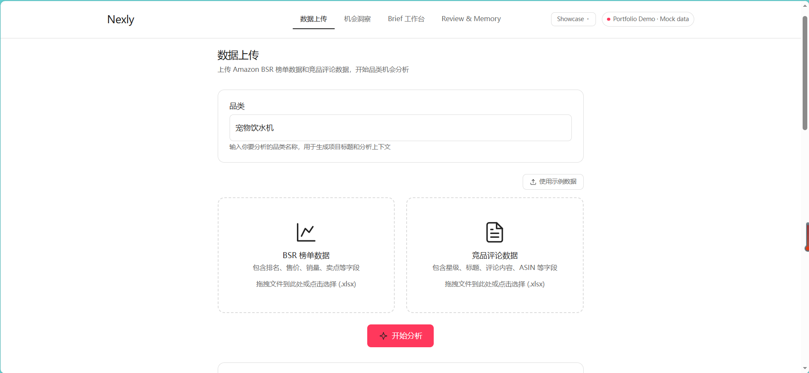
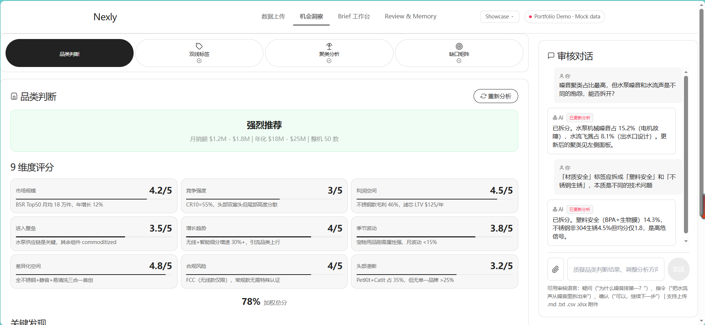
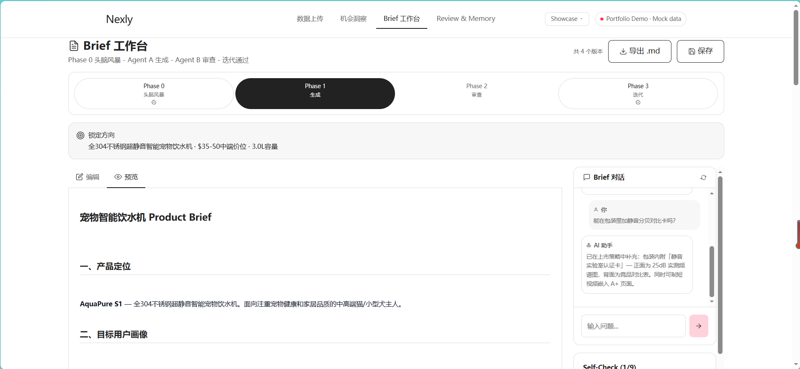

# Nexly — Agentic 产品发现工作台

## 这是什么

Nexly 是一个 AI 辅助的产品发现工作台。它通过多 Agent 分析流水线，将 Amazon 市场数据转化为结构化的 Product Brief — 从原始的 BSR 榜单和竞品评论，到经过人工审核、可迭代的 GTM 文档。

## 为什么要做

Amazon 卖家和产品经理面临一个反复出现的问题：市场数据极其丰富（Best Seller Rank 榜单、数千条用户评论、定价与销量指标），但洞察极其稀缺。典型的工作流是这样的：

- 手动在 Excel 里筛选价格缺口
- 翻阅几百条评论找重复出现的抱怨
- 凭直觉而非证据去判断功能优先级

Nexly 闭合了这个循环。它解析表格数据、给评论打标签（痛点/需求/机会）、聚类成结构化问题、交叉对比市场缺口，最后生成 Product Brief — 每个阶段都有人的决策卡点，确保你始终掌控方向。

## Demo 展示了什么

| 页面 | 用途 |
|------|------|
| 数据上传 | Phase 0 文件类型检测、评论星级/ASIN 分布、BSR 品类概览、质量提示 |
| 机会洞察 | Phase -1 品类判断 → Phase 1 双线标签（评论+BSR）→ Phase 2 痛点聚类+市场聚类 → Phase 3 缺口矩阵+机会评分 |
| Brief 工作台 | Phase 0 头脑风暴（5 轴决策锁定）→ Agent A 生成 12 章 Brief → Agent B 8 维度审查 → 自动修改迭代循环 → 版本 Diff → Markdown 导出 |
| Review & Memory | 按 Phase 分组的对话时间线、决策日志、审查记录、工作流审计追溯 |

右上角 **Showcase ▾** 下拉菜单还包含三个 Portfolio 亮点页面：

- **Run Trace** — 每个 Agent 的输入/输出/耗时/状态时间线，展示 agent observability 设计
- **Evaluation** — 跨品类 7 维度质量评分对比（痛点覆盖率、Brief 完整度、红色风险数、人工确认次数等）
- **Prompt & Schema** — 每个 Agent 的输入输出 schema 定义和 system prompt 摘录

## 重要声明

> **这是一个前端纯 mock 的 Portfolio Demo。** 所有 API 调用由 `mockFetch.ts` 拦截，返回 `demoData.ts` 中的预烘焙数据。没有后端、没有数据库、没有 API Key、没有真实的 LLM 调用。Demo 的设计目的是展示产品工作流和交互设计，不是作为生产系统运行。

## 核心工作流

```
 ┌──────────────┐    ┌───────────────────┐    ┌─────────────────┐    ┌──────────────┐
 │  数据上传    │───▶│   机会洞察        │───▶│  Brief 工作台   │───▶│  Review &    │
 │  Phase 0     │    │  -1 → 1 → 2 → 3   │    │  0 → 1 → 2 → 3 │    │  Memory      │
 └──────────────┘    └───────────────────┘    └─────────────────┘    └──────────────┘
       │                      │                       │                      │
       ▼                      ▼                       ▼                      ▼
  文件类型检测          非线性 Tab              方向锁定               对话审计
  质量评估              决策轴弹窗              Agent A → Agent B     决策追溯
  示例数据              审核对话                自动修改循环            版本历史
```

整个流水线中，每个分析决策都被持久化记录：`ConversationMemory`（按 Phase 分组的对话）→ `DecisionLog`（审核卡点确认）→ `ReviewRecord`（Brief 版本迭代）。

## Agentic 设计

### 多 Agent 架构

| Agent | 角色 | 触发条件 | 产出 |
|-------|------|----------|------|
| **Category Judge** (Phase -1) | 分析 BSR 数据，判断市场结构、价格带、竞争强度 | 用户上传 BSR 文件 | 维度评分、品类判断结论、关键发现 |
| **Review Tagger** (Phase 1A) | 将每条评论标注为痛点/需求/机会信号 | 用户执行 Phase 1 | 18+ 标签类别，含频次和严重度 |
| **BSR Tagger** (Phase 1B) | 按类型/价格带/卖点组合对 BSR 商品标注 | 用户执行 Phase 1 | 9 个市场聚类，含关键指标 |
| **Cluster Analyst** (Phase 2) | 将 Phase 1 分散标签聚合成 7-10 个语义明确的痛点簇和 9 个市场簇，含因果链和覆盖关系 | Phase 1 完成 | 带证据引用的结构化 JSON |
| **Gap Scorer** (Phase 3) | 交叉对比痛点 × 市场缺口，产出多维评分的缺口矩阵 | Phase 2 完成 | 9×9 缺口矩阵 + Top 3 机会 |
| **Brainstormer** (Brief-0) | 基于缺口矩阵生成 5 轴方向锁定问题 | 用户进入 Brief 工作台 | 产品方向、MVP 范围、目标用户、定价、核心差异化 |
| **Agent A — Brief Writer** (Brief-1) | 使用锁定方向 + 完整分析上下文，生成 12 章结构化 Product Brief | 用户确认方向锁定 | 完整 Product Brief（Executive Summary 到 A+ Content） |
| **Agent B — Brief Reviewer** (Brief-2) | 对 8 个质量维度做审查，按 🔴/🟡/🟢 标记问题 | Agent A 完成 | 审查报告，含问题计数和具体修改建议 |
| **Agent A — Auto-Revise** (Brief-3) | 根据 Agent B 审查意见重写 Brief | 用户触发自动修改 | 新的 Brief 版本，风险计数降低 |

### Human-in-the-loop 检查点

1. **决策轴**（Phase -1 后）— 用户选择产品方向和目标价位，之后才开始深度分析
2. **Phase 审核**（Phase 1、2、3 后）— 每个阶段都有明确的「确认并继续」卡点，配专属审核对话面板
3. **方向锁定**（Phase 0）— 用户必须确认全部 5 轴方向后，Agent A 才生成 Brief
4. **自动修改审查** — Agent B 标记问题后，用户决定：手动修改、自动修改、或继续迭代

### 记忆与可观测性

- 所有对话按 Phase 绑定并持久化
- 决策日志记录每次审核卡点确认及时间戳
- 版本历史追踪每次 Brief 迭代（Agent A → Agent B → 人工编辑 → 自动修改）
- Run Trace 页面模拟每个 Agent 的可观测性（输入、输出、耗时、状态）

## Demo vs 生产版

| 能力 | Portfolio Demo（当前） | 生产版（规划） |
|------|----------------------|---------------|
| 文件解析 | `demoData.ts` 中的 mock 结果 | `openpyxl` + raw XML 降级解析（兼容 WPS/namespace 污染） |
| LLM 调用 | 预烘焙 JSON 响应 | DeepSeek/Claude API，含重试、超时和速率限制 |
| 数据持久化 | React 内存状态 | PostgreSQL + Redis（项目状态、Trace 日志、Eval 结果） |
| Agent 编排 | 顺序 mock `jsonResponse()` | 多 Agent 流水线，含依赖解析和错误恢复 |
| 对话记忆 | Mock 聊天历史 | `ConversationMemory` 表（role/phase/type/content） |
| 版本历史 | 静态 demo 条目 | `ReviewRecord` 表，追踪 Agent A/B/人工迭代 |
| 链路追踪 | 模拟 `traceEntries` 数组 | `TraceLogger` 中间件，每次调用捕获负载、token、耗时 |
| 评估 | 3 品类静态评分卡 | CI 门禁级 `eval-harness`，验证痛点覆盖率、Brief 完整度、schema 合规 |
| 证据引用 | 聚类数据中内嵌 `evidences` | 自动从评论摘录链接到聚类 ID |
| 部署 | Vite SPA 静态站点 | Dockerized FastAPI + React，支持 CI/CD 云部署 |

## 截图

| 页面 | 预览 |
|------|------|
| **数据上传** |  |
| **机会洞察** |  |
| **Brief 工作台** |  |

## 生产版路线图

Demo 已经完整展示了交互模型和多 Agent 流程。生产就绪版需要增加：

| 阶段 | 组件 | 描述 |
|------|------|------|
| **1** | 真实后端 | FastAPI + async SQLAlchemy，结构化 API 路由（上传/分析/Brief/对话） |
| **2** | LLM 编排 | 多 Provider 路由（DeepSeek、Claude、GPT），Prompt 版本管理，响应 Schema 校验，指数退避重试 |
| **3** | 评估框架 | 每个 Agent 输出自动评分：痛点覆盖率、Brief 章节完整度、审查红色风险数。CI 门禁集成 |
| **4** | 链路追踪 | 每次 Agent 调用的 `TraceLogger` 中间件：输入快照、输出快照、token 数、挂钟时间。可导出到看板 |
| **5** | 证据引用 | 每个聚类洞察和 Brief 声明对应源评论摘录和 ASIN 引用，实现完全可审计 |
| **6** | 数据库持久化 | 从内存状态迁移到 PostgreSQL：项目生命周期、分析结果、对话记忆、审查记录、评估分数 |
| **7** | 多租户 | 多项目管理、跨品类对比、评估排行榜、团队协作 |
